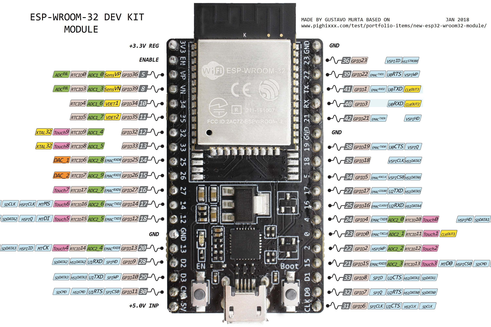

# ESP32 Config

Using ESP32-WROOM-32D Devkitc v4 by Espressif.

## macOS Driver Installation

Otherwise, serial port won't be detected.

<https://www.silabs.com/products/development-tools/software/usb-to-uart-bridge-vcp-drivers>

## Pinout

## VSCode

- Install the Arduino extension
- When you plug in the ESP32, VSCode might prompt you to install a package for the `Arduino Feather ESP8266`. Don't do it! It's a waste of space. Stick to `ESP32 Dev` from the board choices
