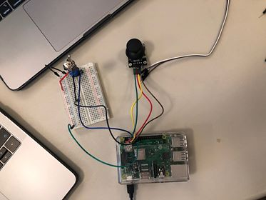

# CPSC 334 - Creative Embedded Systems

## Module 2: Interactive Devices

### Task 1

#### Provided equipment

- Joystick
- Momentary button
- SPST switch
- Raspberry Pi

#### Goals

- Demonstrate three modes of operation
  - A mode is a system state that alters how an input action effects the output
- Have digital output
- Use Raspberry Pi GPIO pins

In this assignment, Processing was used to interface with the Raspberry Pi.

The joystick controls the movement of a shape across the screen. 

#### Execution

The three modes are:

1. The switch changes the moving shape from circle to square
2. The momentary button cycles through two additional modes:
   1. Fast mode: the shape moves 2x as fast across the screen
   2. Reverse mode: Left is right and up is down (this also helps circumvent the limitations due to lack of analog-digital converter)

#### Usage

- Open the sketch from `src` in Processing
- Look at the `setup()` function to see how to connect the pins of the GPIO to the respective components
- Run the sketch
