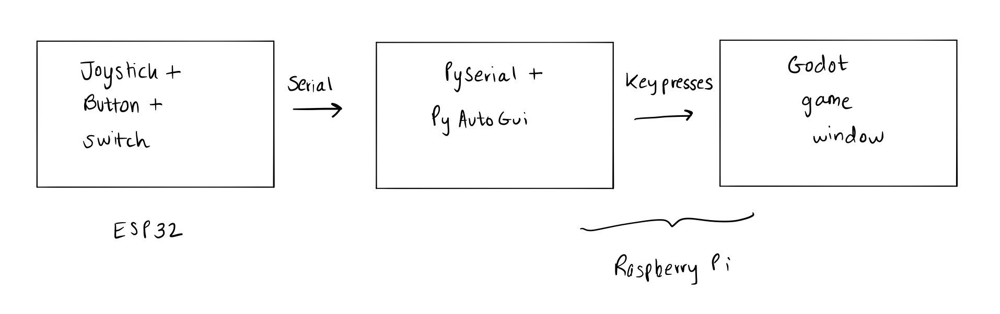

# Performance Device

> Module 2, Task 2

## Table of contents

- [Performance Device](#performance-device)
  - [Table of contents](#table-of-contents)
  - [Task details](#task-details)
  - [Demos](#demos)
    - ["Promotional" video](#%22promotional%22-video)
    - [ESP32 hardware demo](#esp32-hardware-demo)
    - [Early gameplay demo](#early-gameplay-demo)
  - [Gameplay guide](#gameplay-guide)
    - [Keyboard controls](#keyboard-controls)
    - [ESP32 hardware controls](#esp32-hardware-controls)
  - [Development process](#development-process)
    - [Ideation](#ideation)
    - [Implementation](#implementation)
      - [Choice of engine](#choice-of-engine)
      - [Communication between ESP32 and the game](#communication-between-esp32-and-the-game)
      - [Exporting to multiple platforms](#exporting-to-multiple-platforms)
      - [Building enclosures](#building-enclosures)
  - [Installation](#installation)
    - [Raspberry Pi](#raspberry-pi)
      - [Enable OpenGL support](#enable-opengl-support)
      - [Use the browser](#use-the-browser)
      - [Use the compiled binary (smoother experience)](#use-the-compiled-binary-smoother-experience)
    - [Other platforms (Windows, macOS)](#other-platforms-windows-macos)
    - [Use ESP32 with hardware controls](#use-esp32-with-hardware-controls)
      - [Schematic](#schematic)
      - [Run software](#run-software)
  - [Attribution](#attribution)

## Task details

**Objective:**

Create a performance device. Performable is broadly interpreted and may include devices such as digital instruments, or game consoles.

**Constraints:**

- Demonstrate three modes of operation
  - A mode is a system state that alters how an input action effects the output
- Utilize the hardware given out in class
  - Momentary button
  - Joystick
  - SPST switch

## Demos

Ordered by recency.

### "Promotional" video

Made as parody

<https://www.youtube.com/watch?v=MQxkPw-gNHw>

### ESP32 hardware demo

On YouTube here: <https://www.youtube.com/watch?v=X9wXXtjV6eg>

### Early gameplay demo

On YouTube here: <https://www.youtube.com/watch?v=V8MBajHQQWc>

## Gameplay guide

You are in control of a bunny. Hop across the platforms and try to reach the end of the level. Do not fall far or hit spikes.

### Keyboard controls

- `w` to jump
- `a` to move left
- `d` to move right
- `s` to switch character

### ESP32 hardware controls

- Move the joystick left or right to move in that direction
- Press the momentary button to jump
- Flip the pole switch to switch character

## Development process

### Ideation

I wanted to create a video game console. As a single person team, I wanted to create a game that would be of moderate complexity to create and that would run smoothly on the Pi.

With the limited controls available, I thought about which game formats would work the best. I shortlisted two concepts:

1. An endless runner (like Jetpack Joyride)
2. A platforming game (like Mario)

Both ideas are not novel, but would let me explore the game engine (below) and are well suited to traditional hardware controls like joysticks. Any meaningful addition of complexity (for e.g. isometric terrain) would be too difficult to code up in Processing, so I had to think of alternate implementations.

In the end I opted for the platformer because it was easier to implement, given the time and resource constraints.

### Implementation

#### Choice of engine

I considered a number of options:

- Processing: no physics or other nice features. Have to code all logic yourself
- Godot: popular engine but runs slowly on Raspberry Pi
- LÖVE: runs well on the Pi and similar to Processing, but uses Lua, with which I'm unfamiliar

In the end I elected to use Godot, using an older renderer which has compatibility with most hardware.

I was really impressed by how many features Godot has out of the box, including:

- Physics, movement, collision
- Sprite animations
- Camera movements
- Animated parallax backgrounds

Creating even a simple platformer would have been a pain in Processing but was relatively simple in Godot.

I relied heavily on Godot's documentation and a Udemy course I've been meaning to complete since sophomore year.

#### Communication between ESP32 and the game

Godot has little support for WebSockets and Serial data input. I tried to figure out the best way to get data from the ESP32 to the game.

In the end, I had a setup like below:

- The ESP32 transmits input data over serial
- A Python helper program on the Pi transforms those inputs into simulated key presses
- The Godot game window remains in focus on the Pi, and receives the key presses.

#### Exporting to multiple platforms

Godot is able to cross-compile for multiple platforms, and also create a browser version of the game based on WebAssembly. However, there are a few gotchas to be aware of:

- If compiling for macOS, use Godot's GLES3 renderer so that performance is smooth
- If compiling for Raspberry Pi, use Godot's older GLES2 render. Otherwise, the game will not run
  - For the native binary, I use [https://github.com/efornara/frt](https://github.com/efornara/frt). It is a platform that runs Godot binaries on single board computers. I've bundled this with the `linux32_gl2` distribution, and it is included in the install instructions

#### Building enclosures

I used the ESP32 and the input hardware as a controller, and the Pi as a console.

For the controller, I first prototyped a foam construction. However, the foam was tricky to sculpt and work with without a hot-wire cutter.

But I found an Adafruit design for a gamepad, and eventually opted to 3D-print it.

Fitting the electronics inside the enclosure proved to be the trickiest part. Joystick and button alignment was crucial, and I used a hot-glue gun for this purpose. I also used a small piece of breadboard due to the space constraints.

Next, I carved and painted a styrofoam sphere as a mount for the Raspberry Pi.

## Installation

### Raspberry Pi

#### Enable OpenGL support

For all installation methods, this is required.

1. Run `sudo raspi-config`
2. Advanced Settings > GL Driver > GL driver (Full KMS)

#### Use the browser

1. Navigate to the `dist/html5_gl2` directory in a Terminal and run `python3 -m http.server`
2. Use a WebAssembly supported browser to navigate to `0.0.0.0:8000/Platformer Game.html`
3. Use an attached keyboard to play

#### Use the compiled binary (smoother experience)

1. Navigate to `dist/linux32_gl2`
2. Run `frt_095_311_pi2.bin --main-pack game.pck`
3. Use an attached keyboard to play

> Step 2 cannot be run via SSH, since X11 is required. Do it on boot, use VNC or connect the Raspberry Pi to a monitor instead.

### Other platforms (Windows, macOS)

1. Navigate to the `dist/html5_gl3` directory in a Terminal and run `python3 -m http.server`
2. Use a WebAssembly supported browser to navigate to `0.0.0.0:8000/Platformer Game.html`
3. Use an attached keyboard to play

### Use ESP32 with hardware controls

#### Schematic

- `GPIO5`: Momentary button
- `GPIO17`: SPST switch
- `GPIO32`: Joystick Y-axis

Once wired up, plug the ESP32 into the Raspberry Pi. The `serial_interface/interface.py` will assume the Pi is listening on `/dev/ttyUSB0`.

#### Run software

1. Navigate to `src/serial_interface`
2. Install dependencies with `pip3 install -r <PLATFORM>_requirements.txt` (virtual environment recommended).
   1. Replace `<PLATFORM>` with either `linux` or `mac`
   2. For Linux, also install:
      1. `sudo apt-get install scrot`,
      2. `sudo apt-get install python3-tk`
      3. `sudo apt-get install python3-dev`
3. Run `python3 interface.py`  

Leave the terminal running in the background and focus on the game window. The interface will intercept the hardware input and relay it to the game.

## Attribution

- Use of Godot documentation and Udemy course
- Sound effects from OpenGameArt.org
  - Spell by Bart Kelsey
  - Chiptune Adventures by SubspaceAudio
- Sprites from Kenney.nl
