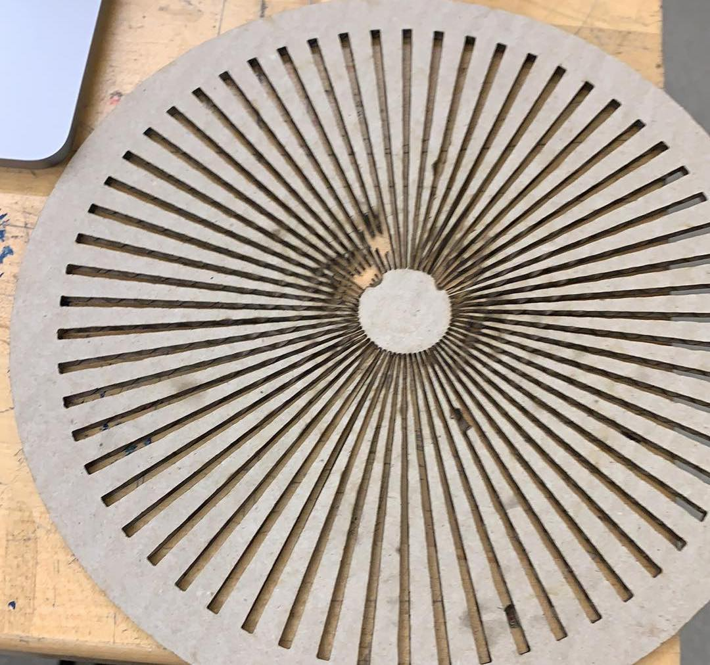

# CPSC 334 - Creative Embedded Systems

> Module 4 Task 2: Kinetic Sculpture

## Table of contents

- [CPSC 334 - Creative Embedded Systems](#cpsc-334---creative-embedded-systems)
  - [Table of contents](#table-of-contents)
  - [Video demo](#video-demo)
  - [Requirements](#requirements)
  - [Goals & vision](#goals--vision)
  - [Technical challenges](#technical-challenges)
    - [Laser cutting the Moire mask](#laser-cutting-the-moire-mask)
    - [Quality of Moire effect](#quality-of-moire-effect)
    - [ESP32 support for multiple steppers](#esp32-support-for-multiple-steppers)
    - [Mounting the stepper](#mounting-the-stepper)
  - [Schematic](#schematic)
  - [Usage](#usage)

## Video demo

Link is here: <https://www.youtube.com/watch?v=QM_IjxTim6Y>

## Requirements

- [x] You must use a minimum of (2\* number of group members) motors and may use as many motors as you have available to your group
- [x] The device must have an enclosure or enclosures
- [x] The device must be safe to operate over long periods of time. For instance, if you have continuous motion, you should **provide a switch** that allows a user to switch off the actuators
- [x] The device utilizes actuators
- [x] Reuses previous sensors, **config code**, **design principles**

## Goals & vision

With FacialMotor, Sarim and I were really interested in the idea of live-animation. Nowadays animation consumed purely digitally even if the artist utilized physical techniques like claymation to create the animation. Using a technique called Moire, we attempted to create an animation through purely physical means. Moire utilizes a mask (such as a wheel with many spokes) to create the illusion of movement. By splicing four frames of animation together, the spokes reveal each frame of animation as it moves, repeating itself like a GIF.

FacialMotor takes some of the animated elements of Moire and combines it with additional modes of movement to create a face that is constantly animated. More specifically, we used the effect of Moire to build the eyes of our “animated face", creating an illusory wave rotating through the eye. The effect was intentionally subtle so as to appear as a natural optical illusion. The nose and mouth were made to look identical, which provided an added quirkiness and simplicity to the form.
The simplicity of the Facial Motor form factor allows it to be transported easily and displayed in many ways.

## Technical challenges

### Laser cutting the Moire mask

The masks we created are for the radial Moire effect. We cut them with a laser cutter. But because the spokes are so fine, they are prone to breaking very easily. We experimented with a number of materials for the right combination of weight and durability.

We started with cardboard, but the extremely fine ends of the spokes would crumble when touched. At that point, we contemplated either scaling up the design (which would also require changes to all our printed animations), or trying other materials.

We next used wood, which best met our needs, and was easy to paint black to increase contrast with the animation. We also cut a mask in acrylic, but it proved to be difficult to paint, and required multiple rounds of rough sanding and coats of acrylic paint.

### Quality of Moire effect

The quality of the effect is dependent on several factors, such as:

1. The contrast and simplicity of the animation

We created multiple animations using Processing and Photoshop. The animation was spread across four frames, and had to be simple enough for a discernable effect. Given all the other problems (below), not all animations worked well. Here is a promising animation of a running person: <https://www.youtube.com/watch?v=tGY2ZNZhZgI>

2. The width of the slits

We contemplated increasing the width of the slits to make the underlying image more visible, however this was a double edged sword because it would mean redoing the animations and adjusting our wheel speed.

3. The speed of the wheel

Each speed + slit-width configuration of the mask corresponds to a particular framerate. For example, the speed of the stepper in our source code is closest to 4 fps. Our animations therefore had to fit in four frames, and anything more complicated would need a faster spin.

### ESP32 support for multiple steppers

Although theoretically the ESP32 should be able to support multiple steppers, in practice it cannot and overheats. Therefore, we used two ESP32s to power one stepper and one servo each.

We also had trouble finding the right pin configurations for multiple steppers on a single ESP32. This is because not all pins are suitable for GPIO as advertised, instead some pins are GPI.

### Mounting the stepper

While the servo has provided shafts that can be hot-glued onto surfaces, there were no such attachments included with the stepper. So we 3D-printed our own gear shaft attachment to connect the stepper to the Moire mask.

## Schematic

## Usage

1. Wire the stepper and servo to the ESP32 as shown in the schematic
   - You may modify the code to support 4 motors on one ESP32, however for us this led to overheating so we used two ESP32s
2. Upload the sketch in the `src/1_esp32_sketch` folder to all ESP32s
3. Connect the actuators to the Moire masks
