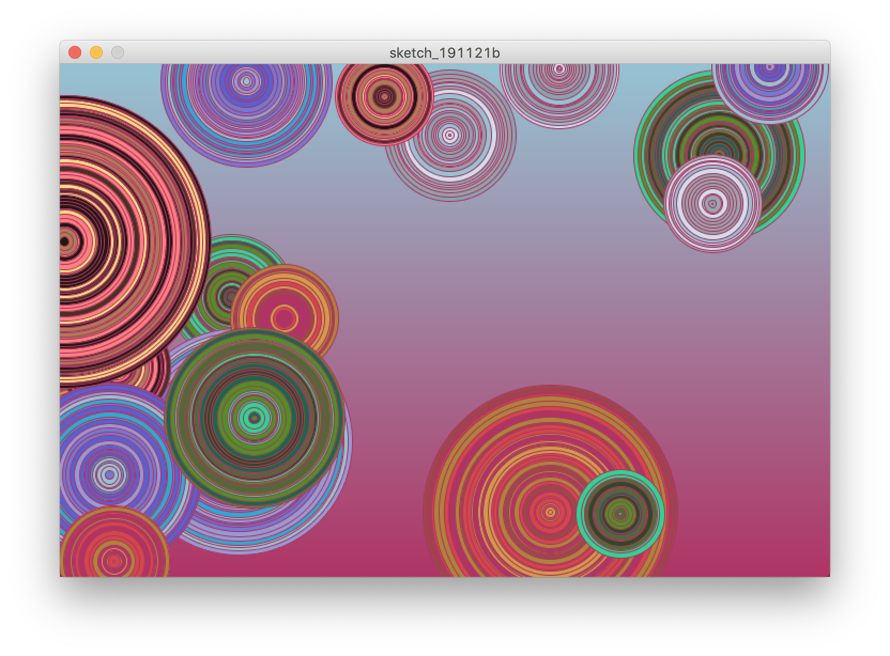

# AKW Takeover

A group project for Yale CPSC 334 (Creative Embedded Systems)

Team members: Sarim Abbas, Daniel Kaylor, Alexi Christakis, Sam Lopate, Sabrina Long

### Task 1 Documentation

We are using a mesh network to connect our 5 ESP32 boards to each other and to two Raspberry Pis that will be used for actualization. We will be placing our sensors on the 2nd floor atrium and the 3rd floor Zoo of AKW as follows: one in the Closed Zoo, one in the Open Zoo, one in the kitchenette area, one by the blackboards near the central stairs to the third floor, and one in the classroom on the far end of the floor. One of our Raspberry Pis will be projecting a display onto a wall from the third floor so that the display will be visible from the atrium.

We are using painlessmesh and painlessmeshboost on the ESP32s and Pis to connect to the mesh network, respectively. The sensors will be sending data in JSON format to the projecting Pi, which will load the data into a log file in the format of "tag-val1-val2..." for however many values there are. The "tag" part of the message will be used to identify from which sensor the data came.

- [Sarim's Volcano Input documentation](./mesh/sarim-earth-input/)
- [Alexi's Earthquake Input documentation](./mesh/alexi-input/)

### Task 2 Documentation

#### Sarim's visualization

Demo video on YouTube: <https://www.youtube.com/watch?v=5bXN0hbBsPI>

The mesh input data is visualized as concentric circles, one drawn for each data point. The circles are colored according to their source elements, i.e. air, water, earth, fire and lava. A new gradient background (computed from two randomized elements) is also set every 10 frames, which lets the visualization start anew. The proportion of each element's circles corresponds roughly to the respective inputs' usage by passerby.

#### Alexi's visualization

My concept for this visualization was to encourage the occupants of AKW to arbitrarily divide themselves into teams corresponding with each device in our network. To accomplish the encouragement aspect, my visualization is a form of a leaderboard, where the stimulation of each sensor accumulates over time. The summations are displayed in a piechart so that members of each team can track their progress and compete to increase their value the fastest.

#### Daniel's visualization

The theme for our project was "Elements." One of our main inspirations was the classic cartoon from our childhoods, *Avatar: The Last Airbender*. With this in mind, I chose to take on the element of air. I thought that I could find some interesting gifs that demonstrate just how original the show was with its treatment of elemental manipulation as well as tie in my visualization to the other sensors in the project. I found some cool airbending gifs and one that showed the four most recent avatars entering the "Avatar State," a mode which grants them heightened control over the elements and world-altering capabilities. I wanted to empower the user of my sensor to feel like an airbender themselves; I often think about how we can manipulate elements in similar, albeit less powerful, ways. Just blowing air from our mouths is elemental manipulation! Or splashing water. Or, even more out there, we have talking, which we consider to be completely mundane, but that's because the norm for us is that people have the ability to perceive vibrations in the air which can communicate totally abstract ideas to us. But what about hypothetical intelligent species that do not sense in this way? Would speaking seem like some form of telepathy to them if they have no way to perceive those vibrations? I love spinning the unremarkable abilities of humans into impressive, alien traits this way.

My original idea was for the idle state of the visualization to repeat the gif of Aang floating with the ball of air, and then cycle through the avatar state and the gif of the man airbending when someone blew on the pinwheel. The lava gif would be used for when someone activated Sarim's volcano and my pinwheel at the same time. However, with my technical difficulties, I ended up only using Sarim's sensor to know when to play the lava gif, while the rest of the time I would just cycle through the other three gifs.

#### Sabrina's visualization

Video: https://youtu.be/lH3Er2HlccU

This visualization associates each group member's sensor data with a visual output that correspons to the way their sensor is meant to be interacted with. For example, readings from Daniel's pinwheel sensor determine the rotation of the squares/circles, Sam's amplitude sensor readings are reflected in the visualization by changing the x and y positions of the poem lines, and Sarim's lava joystick sensor displays a lava image when the circle is completed.
