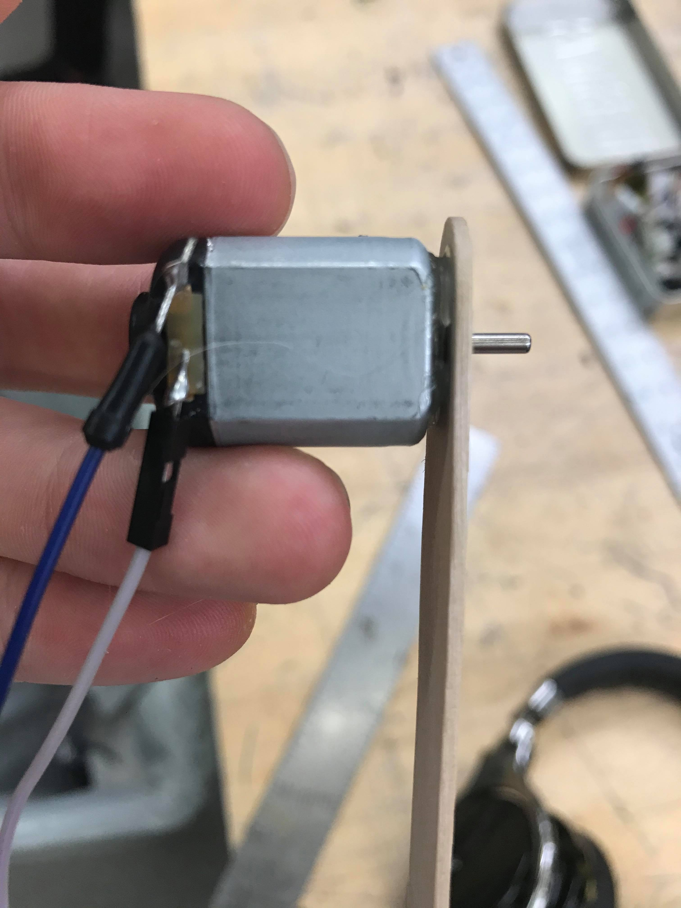
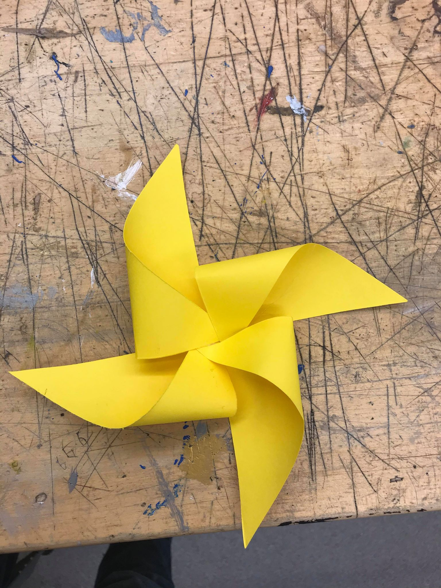
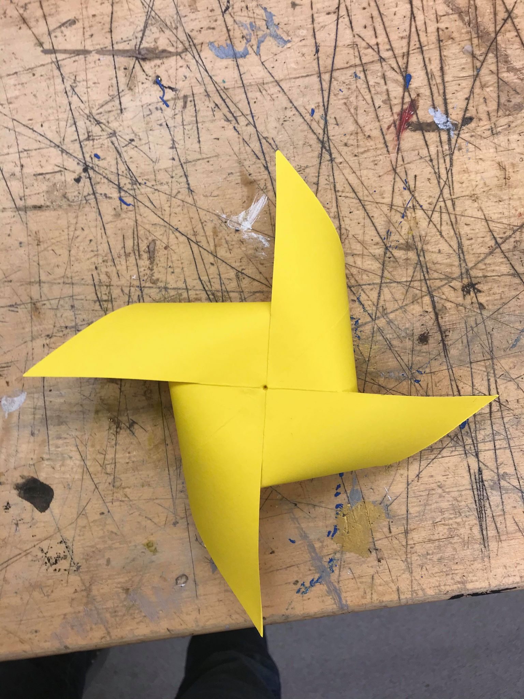
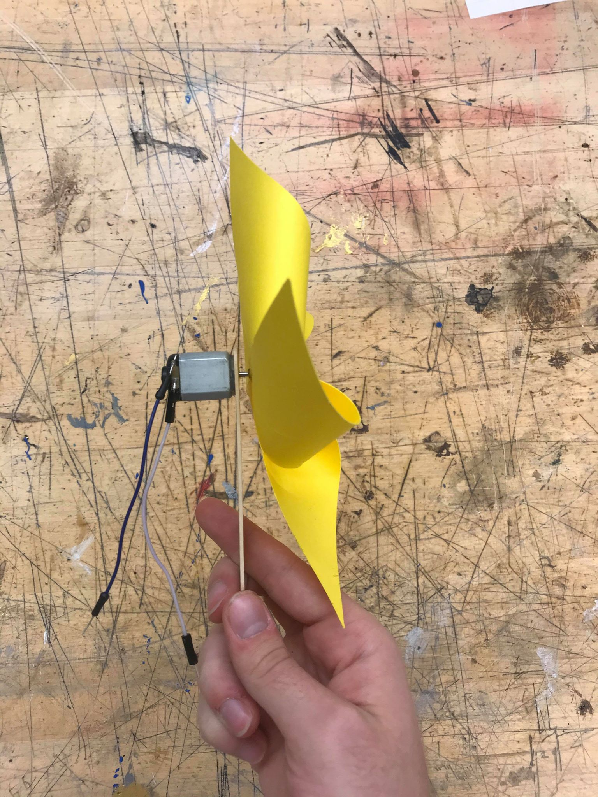
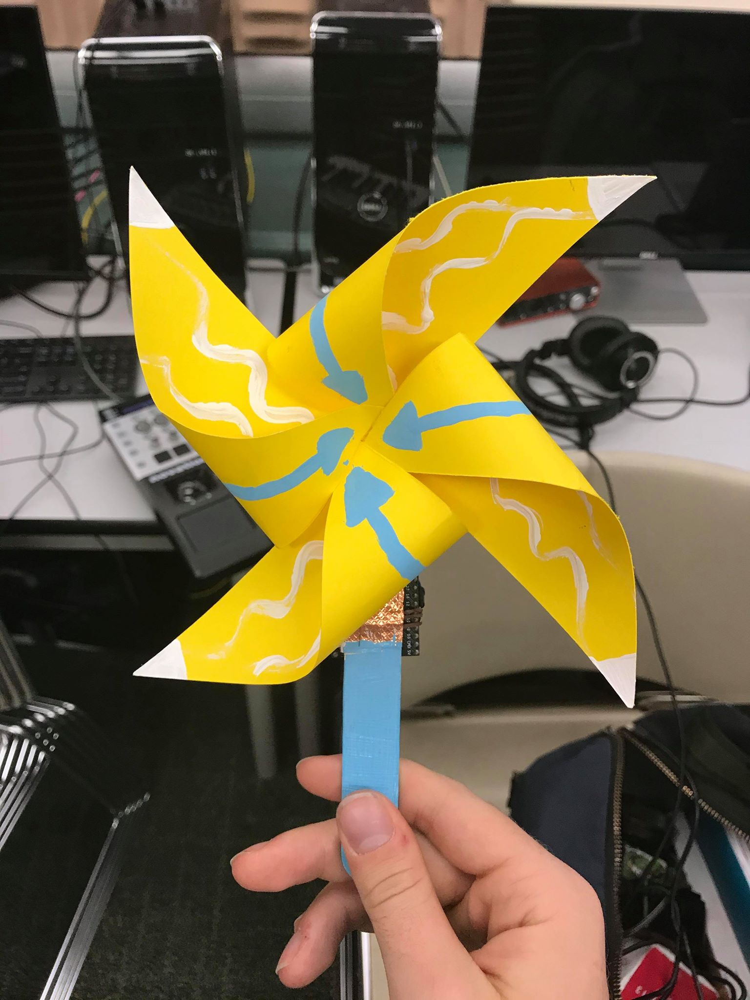
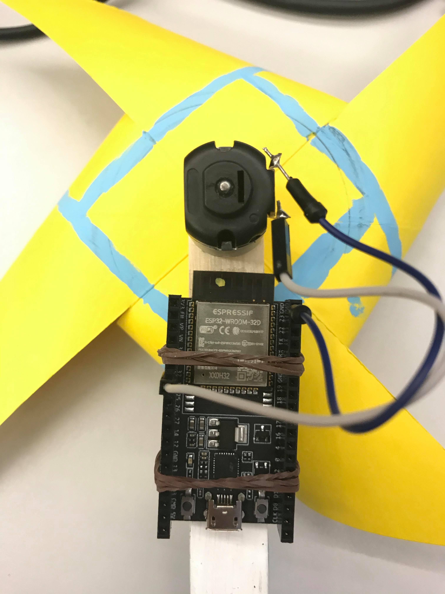

#  Air Input

Within the elemental theme we chose, I decided on air. I thought a pinwheel was a classic, simple, and on-theme device to make with satisfying interaction. I thought that it would be really cool to make my own sensor with a pinwheel by generating voltage with a DC motor when the pinwheel spins.

## Video Demo
A demonstration of the intended behavior:
https://youtu.be/7gcST8KZ-As

## Design/How-To

I wanted the design to be easily reproducible so the pinwheel only uses common components, though a more effective sensor could be made with some upgrades.

I followed the instructions [this website](http://www.leslietryon.com/3dcolorcutout/makepinw/makepinwheel.html) to make my pinwheel, with some alterations to suit this project.

The first thing you should do is bore a hole in your wooden dowel with a thumback or something else small and sharp. This may be challenging since the dowel splinters lengthwise easily, but if you are careful and slow, you will have a better time. You can also drill a small hole if you have access to power tools. You need to bore a hole wide enough so that the shaft fits comfortably inside with room so that it may rotate freely.

Then, stick your DC motor in the dowel and hot glue it as in the following picture: 

Now, we will turn to the pinwheel blades. Follow the steps on the website above, also [linked here.](http://www.leslietryon.com/3dcolorcutout/makepinw/makepinwheel.html) I recommend using sturdy paper to improve the durability of the pinwheel at the cost of some convenience, since stiffer paper is harder to glue. However, instead of using a thumbtack to hold the folds down in the center, we will be using hot glue. Glue the folds down however you need to; it should look something like this in the end:

Next, use a thumbtack to poke a hole in the center of the paper from the back. Widen the hole so that the shaft of the DC motor fits snugly inside the hole. The hole shouldn't go all the way through to the front of the pinwheel. The back should look like this:

Finally, hot glue the shaft of the motor to the hole in the back of the paper. It should look like this:

That's it! You've completed the pinwheel portion. Mine spun pretty easily, which you can see in [this demo](https://youtu.be/XqrjjxGu9Co). You can decorate however you want; I decided to emulate the arrow tattoos on Aang from Avatar: The Last Airbender, but you can do whatever you like. To finish the sensor, attach an ESP32 to the dowel (I used rubber bands) and connect the jumpers off the DC motor to the input pin of your choice and ground on the ESP32. Flash arduino code in this folder to your ESP32 and it will connect to the mesh network. (Warning: the code here includes taking in input from the volcano sensor in this repo. It shouldn't be a problem to run, but fair warning!)

The final product may look something like this: 

The following picture shows the ESP32 on the back. Your very, very simple circuit could look like this:

Note: you may need to amplify the voltage from the motor. Or use a nicer motor. As is, this project is not very viable.

## Behavior and Technical Difficulties

I ran into enough technical difficulties with this that I'm lumping these two sections together. 

The original intended behavior of the sensor can be found in the [README.md file of the repo](../../README.md) but I will quote it here:

"My original idea was for the idle state of the visualization to repeat the gif of Aang floating with the ball of air, and then cycle through the avatar state and the gif of the man airbending when someone blew on the pinwheel. The lava gif would be used for when someone activated Sarim's volcano and my pinwheel at the same time. However, with my technical difficulties, I ended up only using Sarim's sensor to know when to play the lava gif, while the rest of the time I would just cycle through the other three gifs."

What I intended was for the pinwheel to generate enough voltage that the ESP would pick up on the spinning and choose what gif to play based on that. However, the DC motor proved to not produce enough voltage to be detected, even with an op-amp hooked up to it. This was very unfortunate but I learned a valuable lesson on putting all of my eggs in one basket. I had intended for there to be some other mode of interacting with the sensor but nothing held up when the mesh code was being run on it as well, so I ended up not having a very good sensor at all. A little disappointing, but the principle was cool and I still found the exercise fruitful.

I didn't run into too many difficulties with the mesh code. Getting the gifs to play on Processing was fun (you have to load in every frame) but didn't pose any problems. I did have trouble getting the Raspberry Pi to play the gifs, which was unfortunate, but it ran fine on my laptop. As a group, we had some issues with the formatting of the messages we were sending over the mesh, but this is not specific to my sensor.

Took a leap, fell flat on my face. On the topic of airbending, you've gotta fall a few times in order to fly...! At least the pinwheel was pretty.
