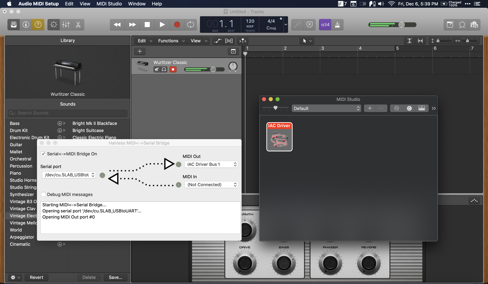
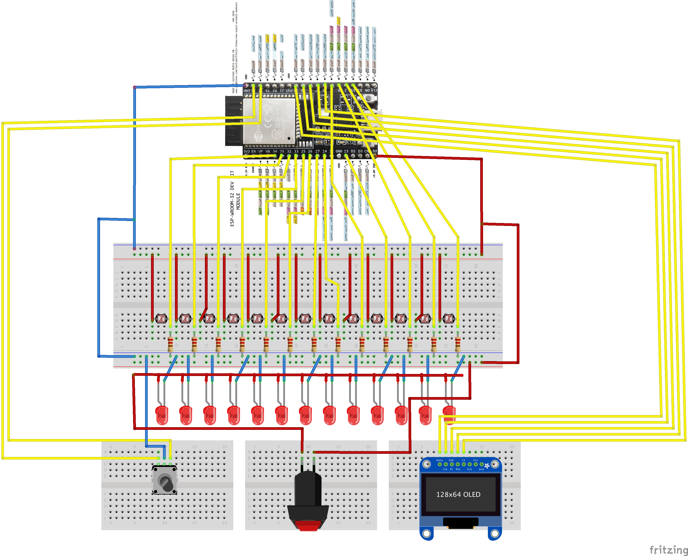

# Laser Piano

> CPSC 334 - Creative Embedded Systems - Module 6 - Final Project

YouTube video: <https://www.youtube.com/embed/T0WQOCh6yS0>

## Introduction

The laser piano can be played by moving one’s fingers through the air. It is motivated by the desire to break the tactile link between the musician and their instrument, and to create opportunities for learning and experimentation. The enclosure is made of laser cut pieces of acrylic to give transparency into the underlying electronics. Thirteen laser diodes shine beams onto corresponding photoresistors: these beams correspond to the keys in a traditional piano octave. Each laser beam can be “plucked” by a finger to play a note. The beams can optionally be visualized using mist. A dial allows one to switch octaves. At the heart of the system is an ESP32 module that relays sensor data, using the MIDI protocol, to a laptop running any compatible DAW software e.g. Logic.

## Table of contents

- [Laser Piano](#laser-piano)
  - [Introduction](#introduction)
  - [Table of contents](#table-of-contents)
  - [Motivation](#motivation)
  - [Budget](#budget)
  - [Challenges and development](#challenges-and-development)
    - [Enclosure design](#enclosure-design)
    - [Photoresistor readings](#photoresistor-readings)
    - [Calibration process](#calibration-process)
    - [MIDI setup](#midi-setup)
    - [ESP32 issues](#esp32-issues)
    - [Use of display and rotary encoder](#use-of-display-and-rotary-encoder)
  - [Possible safety concerns](#possible-safety-concerns)
  - [Schematic](#schematic)

## Motivation

Our class discussion on creativity influenced me to seek out new areas where I could find the right combination of originality, value, surprise and aesthetics that would be creatively significant. One area I had not explored was music. I was intimidated by it since I had no previous experience in music or musical instrument design. However, analogs with physics (e.g. the properties of sound; pitch, amplitude) and computer science (8-bit MIDI and its relation to frequency) helped make learning about music more manageable. Initially, I had wanted to make a black-box instrument that would use ultrasonic distance sensing of nearby people to modulate various properties (pitch, amplitude) of a fixed track. However, after trialling ultrasonic capabilities (see `src/tests`) and finding a lack of better alternatives, I decided on a more "traditional" instrument, in the sense that it would allow the same hypothetical flexibility as a piano or guitar would. However, I wanted to break the 1:1 tactile link which usually binds the musician to an instrument and create an "unseen effect", while maintaining the same flexibility. Hence, after some searching of the solution space, I decided to build a laser piano.

## Budget

| Name                  | Units | \$/unit      | Total \$ cost |
| --------------------- | ----- | ------------ | ------------- |
| Wooden dowels         | 2     | Free in CEID | 0             |
| 13 x 11 acrylic piece | 1     | Free in CEID | 0             |
| Laser diodes          | 13    | 0.55         | 7.15          |
| Photoresistors        | 13    | Free in CEID | 0             |
| DAW e.g. Logic        | 1     | Variable     | -             |

Tools required:

- Laser cutter
- Drill
- Hot glue
- Wire cutter
- Soldering iron

## Challenges and development

### Enclosure design

- Initially I had wanted to make the instrument a black-box, which would add to the mystery of the workings of the instrument. But after accidentally laser cutting a piece of acrylic instead of wood, I thought it would be interesting to pivot and give the user/viewer insight into the bare metal.
- To effectively showcase the inner workings and electronics, I gave lots of thought to the circuit layout, its symmetry and color coding of wiring.
  - The photoresistors, for example, are soldered to common rails to minimize clutter.
  - Many of the wires were painstakingly manuevered underneath the resistor plate with a pair of tweezers in order to give a neat appearance.
  - Similarly, the wires connected to the laser diodes were folded among themselves to give a neat appearance.

### Photoresistor readings

- The 13 photoresistors are connected in parallel in separate potential divider circuits across a shared 5V source. However, since these resistors from the CEID were unlabelled with their peak resistances, the readings across them were inconsistent.
- Typically, though, we can expect them to range from 0/150+ for complete darkness to 500+ for ambient to 1500+ for bright, directed light. These are the values output by the ESP32 ADCs, which have a low-high of 0-4095.
  - To overcome inconsistencies, a calibration process on device startup individually set activation thresholds for each photoresistor. This calibration process is described below.

### Calibration process

YouTube video: <https://www.youtube.com/embed/qF3r_-Wi_mg>

When the device is first powered on, the display informs the user to prepare for the calibration process.

- 5 readings are taken at LOW and averaged.
- Then, the user is instructed to turn on the lasers via a dedicated switch. This switch was not strictly required, as the ESP32 can easily turn on the lasers automatically. However, I decided to include this interaction as it gives the musician the feeling of "tuning" their instrument.
- Once the lasers are turned on, 5 readings are taken at HIGH and averaged.
- The activation thresholds are set roughly as `x(HIGH + LOW)` for each resistor, where `x` is a magic number, set to around `0.6`. This means that more sensitive resistors (which generally have smaller ranges) have smaller activation thresholds.

### MIDI setup

- Many options were tried:
  - ESP32 MIDI BLE => MIDI in to Logic on macOS
  - ESP32 Serial Out => Python Script on macOS => MIDI in to Logic on macOS
  - ESP32 MIDI over Serial Out => Hairless MIDI app on macOS => MIDI in to Logic on macOS
- The first option was not reliable as the Bluetooth connection between the ESP32 and macOS kept dropping.
- The second and third options are quite similar, but whereas I would have had to write the logic by myself in Python using a library like [Mido](https://mido.readthedocs.io/en/latest/), with Hairless MIDI this is already taken care of.
- Hairless MIDI is currently compiled for 32-bit, which posed a problem since I am using macOS Catalina. However, [this GitHub issue](https://github.com/projectgus/hairless-midiserial/issues/51) has an experimental 64-bit version. However, the Preferences must be re-saved in order for the program to work without crashing.
- The Hairless MIDI website [describes the required setup](https://projectgus.github.io/hairless-midiserial/), which involves enabling an IAC Driver Bus in the macOS MIDI settings.

### ESP32 issues

- Some pins (e.g. GPIO 13) are used for boot up, and setting them as INPUT interferes with the flashing process. The solution is not to use the pin or leave it unplugged during boot. [Relevant issue on Github](https://github.com/espressif/esp-idf/issues/113).

### Use of display and rotary encoder

YouTube video: <https://www.youtube.com/embed/hD_vjbFaM68>

- To add the octave switching functionality, I paired a rotary encoder to act as a dial, with a display providing feedback.
  - Surprisingly, the display does not require VCC and GND connections, and the data pin connections suffice.
- Both components are mounted on independent breadboards to make the instrument modular.
- The rotary encoder saturates at very low or high values, which allows the user to easily cycle through the octaves.
  - The encoder library used has an outdated version available in the Arduino Library manager, so I manually downloaded and included the master branch available at its GitHub page.

## Possible safety concerns

1. Lasers: since the laser beams are not intensely collimated, and the reflection from the resistors is diffuse, using the instrument should not pose significant risk to vision. Nevertheless, safety glasses were provided during viewings and viewers are advised not to look directly into the source of the beams.
2. Wiring: the exposed wiring runs at 5 volts (V) and is safe to touch.

## Schematic

