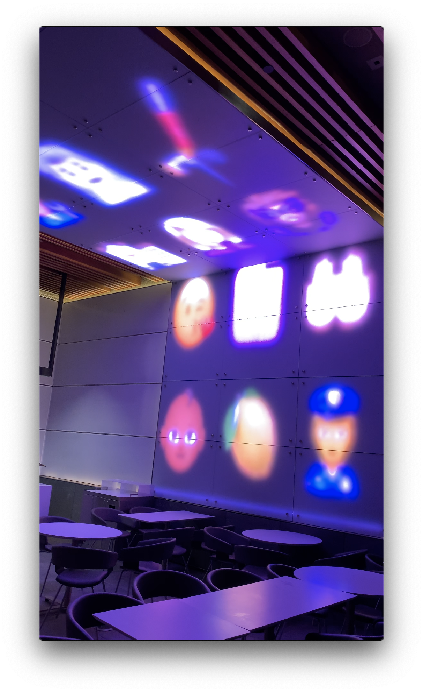

# CPSC 334 - Creative Embedded Systems

## Table of Contents

- [CPSC 334 - Creative Embedded Systems](#cpsc-334---creative-embedded-systems)
  - [Table of Contents](#table-of-contents)
  - [Modules](#modules)
    - [Module 6: Musical Instrument](#module-6-musical-instrument)
    - [Module 5: Distributed Network](#module-5-distributed-network)
    - [Module 4: Kinetic Sculpture](#module-4-kinetic-sculpture)
    - [Module 3: Going Wireless](#module-3-going-wireless)
    - [Module 2: Interactive Devices](#module-2-interactive-devices)
    - [Module 1: Generative Art](#module-1-generative-art)

## Modules

> Descending order

### Module 6: [Musical Instrument](./6_musical_instrument/)

### Module 5: [Distributed Network](./5_distributed_network/)

### Module 4: [Kinetic Sculpture](./4_kinetic_sculpture/)

### Module 3: [Going Wireless](./3_going_wireless/)

### Module 2: [Interactive Devices](./2_interactive_devices/)

### Module 1: [Generative Art](./1_generative_art/)

