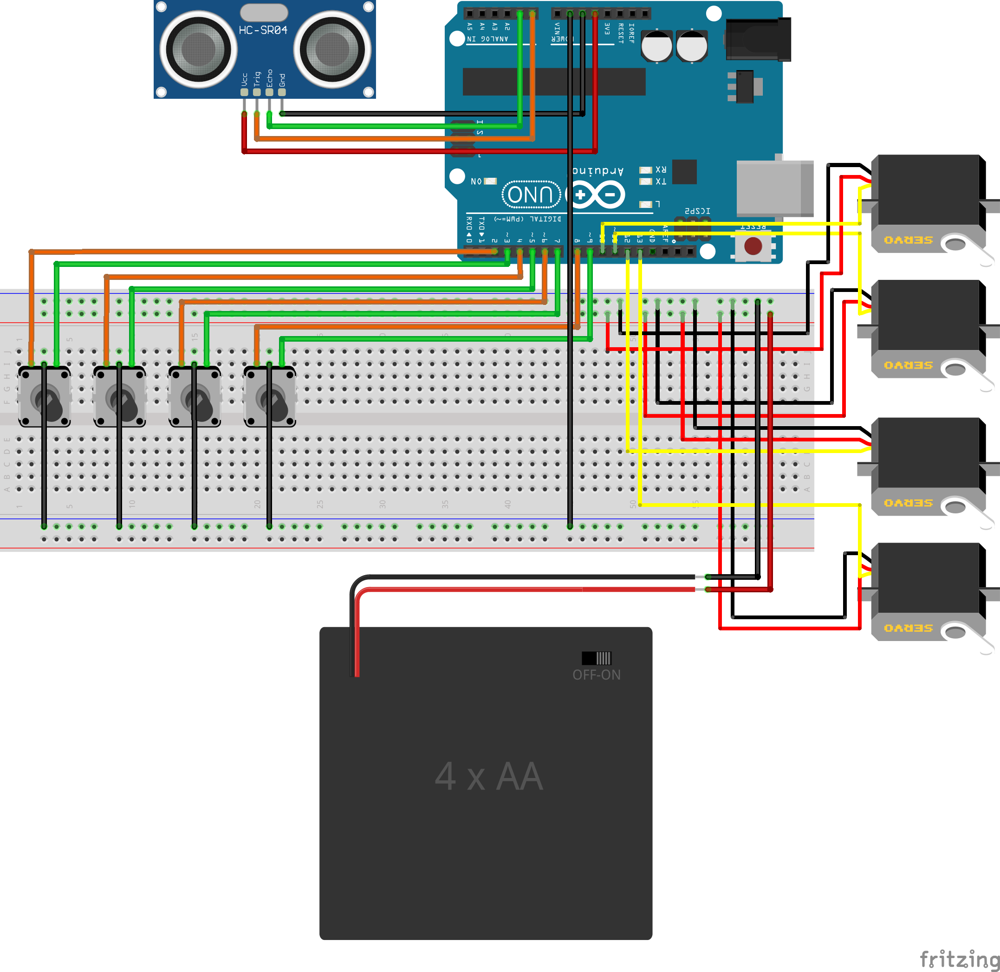

# CS338 Final Project

<https://github.com/sarimabbas/cs338-project>

## Table of Contents

- [CS338 Final Project](#cs338-final-project)
  - [Table of Contents](#table-of-contents)
  - [Introduction](#introduction)
  - [Poster](#poster)
  - [Setup](#setup)
    - [Robot assembly](#robot-assembly)
    - [Schematic/breadboard](#schematicbreadboard)
      - [Pin connections](#pin-connections)
    - [Software](#software)
  - [Demos](#demos)
    - [Rotary encoders - manual control](#rotary-encoders---manual-control)
    - [Pick and place](#pick-and-place)
    - [Game controller - manual control](#game-controller---manual-control)
    - [Ultrasonic sensor - turtling behavior](#ultrasonic-sensor---turtling-behavior)
  - [Future work](#future-work)

## Introduction


This project comprises of a 3D-printed robot arm with four separate software demos to give an idea of potential use cases.

The arm is based on the EEZYBot MK1. The parts were printed in the Center for Engineering, Innovation and Design (CEID). A custom base plate was also designed and printed to house the various electrical components. 

The robot arm has 4 DOF: waist/base, shoulder, elbow and gripper. In software, these are referred to as `base/BS`, `upDown/UD`, `frontBack/FB` and `gripper/GR` respectively. 

## Poster

Below is the poster highlighting the four software demos, which was used for the poster session. 


PDF is available [here](./docs/poster/poster.pdf). 

## Setup

### Robot assembly

`stl` files and assembly instructions can be found here: <http://www.eezyrobots.it/eba_mk1.html#>

### Schematic/breadboard

Besides the robot, the following additional components are required: 

- 1 - Arduino Uno
- 4 - rotary encoders
- 1 - HC-SR04 ultrasonic sensor
- 4 - SG90 servos
- 1 - 4xAA Battery holder (to power servos) 
- Breadboard and wire

These are connected as per the following breadboard view:



PDF is available [here](./docs/schematic/schematic_bb.pdf).

#### Pin connections

The robot driver has a `driverSetup()` function which accepts pins for each servo. In the schematic, the following pins are used:

- frontBack/FB: 10
- upDown/UD: 11
- gripper/GR: 12
- base/BS: 13

The rotary encoders are connected to:
- frontBack/FB: 2, 3
- upDown/UD: 4, 5
- gripper/GR: 6, 7
- base/BS: 8, 9

Lastly, the HC-SR04 ultrasonic sensor is connected to:

- TRIG: A0
- ECHO: A1

### Software

The Arduino IDE is required. Within the IDE, the following libraries must be installed:

- Encoder
- Bifrost for HC-SR04
- ArduinoJson
- Servo

A Python virtual environment is also required for the game controller demo. To create one:

```bash
python3 -m venv ~/.virtualenvs/myVirtualEnv

source ~/.virtualenvs/myVirtualEnv/bin/activate

pip3 install pygame
pip3 install pyserial
```

PyGame has a number of external dependencies which vary by OS. These can be installed by following this guide: <https://nostarch.com/download/Teach_Your_Kids_to_Code_InstallingPygame_MacLinux.pdf>

## Demos

### Rotary encoders - manual control

To use this demo, upload `src/demo_0` to the Arduino. Make sure the servos are powered on.

You should be able to control each joint using a rotary encoder. The input saturates to a point - the joint can turn no further.

Here's a video of the interaction: <https://youtu.be/vtAuMasHtZk>

### Pick and place

To use this demo, upload `src/demo_1` to the Arduino.

The `driver.hpp` and `driver.cpp` files contain useful helper functions such as `moveLeft()` and `moveUp()` which can be used to script some interactions without writing much code. The movements are based on some thresholds that may be modified to adapt to different use cases.

These have been used to create some pick and place behavior. Here's a video of the interaction: <https://youtu.be/sw9eGx-feeU>

### Game controller - manual control

To use this demo, upload `src/demo_2` to the Arduino. Then, open the controller script using `python3 src/demo_2/controller.py`. Make sure a controller is connected to your computer. The script has been tested with an Xbox One Wireless controller over Bluetooth.

Here are the controls:

- Moving the left stick left-right turns the robot base.
- Moving the left stick forward-backward turns the robot shoulder.
- Moving the right stick forward-backward turns the robot elbow.
- Pressing A opens and closes the gripper.

Here's a video of the interaction: <https://youtu.be/9GZomNd3jlo>

### Ultrasonic sensor - turtling behavior

To use this demo, upload `src/demo_3` to the Arduino.

The sensor is attached to the robot gripper ("the face") using adhesive.

When an object, e.g. human hand, gets too close, the robot retracts (as if into a shell). When the hand goes further away, the robot moves forward back to its original position, as if curious.

Here's a video of the interaction: <https://youtu.be/myK5MGR7y6I>

## Future work

One idea was to run a ROS node on the Arduino using the `rosserial_arduino` package. However, ROS master requires a Linux device for maximum compatibility. A good candidate is a Raspberry Pi. However, compiling ROS on a Raspberry Pi takes a substantial amount of time. More promising are ready-made Raspbian images with ROS pre-installed that can be flashed onto the Raspberry Pi.

ROS opens up a number of possibilities. Using the pub/sub messaging system, it is possible to synchronize multiple processes (such as the four demos) to run together. It also opens up possibilities for integrations with numerous APIs such as speech recognition, camera tracking, services via webhooks etc.
